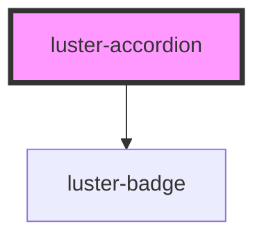

# luster-accordion

<!-- Auto Generated Below -->

## Properties

| Property       | Attribute       | Description | Type                                            | Default     |
| -------------- | --------------- | ----------- | ----------------------------------------------- | ----------- |
| `badge`        | `badge`         |             | `string`                                        | `''`        |
| `badgeVariant` | `badge-variant` |             | `"beta" \| "default" \| "primary" \| "success"` | `'default'` |
| `expanded`     | `expanded`      |             | `boolean`                                       | `false`     |
| `heading`      | `heading`       |             | `string`                                        | `''`        |
| `subtitle`     | `subtitle`      |             | `string`                                        | `''`        |

## Events

| Event      | Description | Type                   |
| ---------- | ----------- | ---------------------- |
| `dcToggle` |             | `CustomEvent<boolean>` |

## Dependencies

### Depends on

- [luster-badge](../luster-badge)

### Graph

----------------------------------------------

*Built with [StencilJS](https://stenciljs.com/)*
