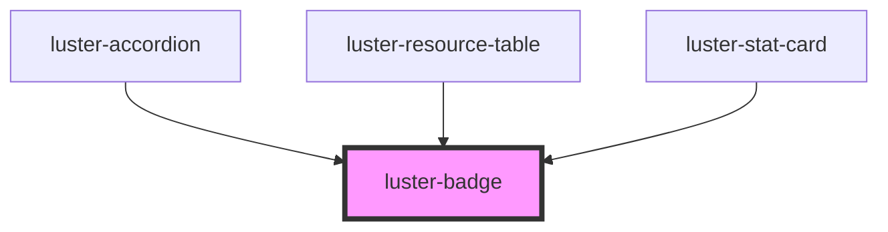

# luster-badge

<!-- Auto Generated Below -->

## Properties

| Property  | Attribute | Description | Type                                                                              | Default     |
| --------- | --------- | ----------- | --------------------------------------------------------------------------------- | ----------- |
| `dot`     | `dot`     |             | `boolean`                                                                         | `false`     |
| `size`    | `size`    |             | `"md" \| "sm"`                                                                    | `'md'`      |
| `variant` | `variant` |             | `"beta" \| "default" \| "error" \| "live" \| "primary" \| "success" \| "warning"` | `'default'` |

## Dependencies

### Used by

 - [luster-accordion](../luster-accordion)
 - [luster-resource-table](../luster-resource-table)
 - [luster-stat-card](../luster-stat-card)

### Graph

----------------------------------------------

*Built with [StencilJS](https://stenciljs.com/)*
