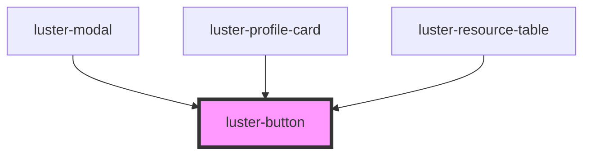

# luster-button

<!-- Auto Generated Below -->

## Properties

| Property    | Attribute    | Description | Type                                                      | Default     |
| ----------- | ------------ | ----------- | --------------------------------------------------------- | ----------- |
| `disabled`  | `disabled`   |             | `boolean`                                                 | `false`     |
| `fullWidth` | `full-width` |             | `boolean`                                                 | `false`     |
| `loading`   | `loading`    |             | `boolean`                                                 | `false`     |
| `size`      | `size`       |             | `"lg" \| "md" \| "sm"`                                    | `'md'`      |
| `type`      | `type`       |             | `"button" \| "reset" \| "submit"`                         | `'button'`  |
| `variant`   | `variant`    |             | `"destructive" \| "primary" \| "secondary" \| "tertiary"` | `'primary'` |

## Events

| Event     | Description | Type                |
| --------- | ----------- | ------------------- |
| `dcClick` |             | `CustomEvent<void>` |

## Dependencies

### Used by

 - [luster-modal](../luster-modal)
 - [luster-profile-card](../luster-profile-card)
 - [luster-resource-table](../luster-resource-table)

### Graph

----------------------------------------------

*Built with [StencilJS](https://stenciljs.com/)*
