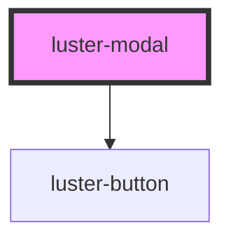

# luster-modal

<!-- Auto Generated Below -->

## Properties

| Property       | Attribute       | Description | Type                   | Default     |
| -------------- | --------------- | ----------- | ---------------------- | ----------- |
| `cancelLabel`  | `cancel-label`  |             | `string`               | `'Cancel'`  |
| `confirmLabel` | `confirm-label` |             | `string`               | `'Proceed'` |
| `heading`      | `heading`       |             | `string`               | `''`        |
| `open`         | `open`          |             | `boolean`              | `false`     |
| `size`         | `size`          |             | `"lg" \| "md" \| "sm"` | `'md'`      |
| `subtitle`     | `subtitle`      |             | `string`               | `''`        |

## Events

| Event       | Description | Type                |
| ----------- | ----------- | ------------------- |
| `dcClose`   |             | `CustomEvent<void>` |
| `dcConfirm` |             | `CustomEvent<void>` |

## Dependencies

### Depends on

- [luster-button](../luster-button)

### Graph

----------------------------------------------

*Built with [StencilJS](https://stenciljs.com/)*
