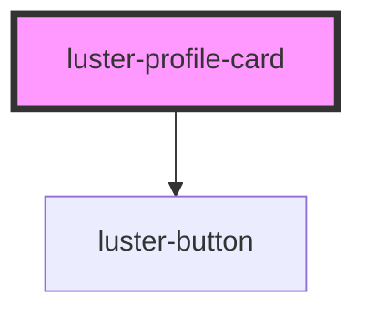

# luster-profile-card

<!-- Auto Generated Below -->

## Properties

| Property     | Attribute      | Description | Type     | Default            |
| ------------ | -------------- | ----------- | -------- | ------------------ |
| `avatar`     | `avatar`       |             | `string` | `''`               |
| `ctaLabel`   | `cta-label`    |             | `string` | `'View Portfolio'` |
| `name`       | `name`         |             | `string` | `''`               |
| `role`       | `role`         |             | `string` | `''`               |
| `stat1Label` | `stat-1-label` |             | `string` | `''`               |
| `stat1Value` | `stat-1-value` |             | `string` | `''`               |
| `stat2Label` | `stat-2-label` |             | `string` | `''`               |
| `stat2Value` | `stat-2-value` |             | `string` | `''`               |

## Dependencies

### Depends on

- [luster-button](../luster-button)

### Graph

----------------------------------------------

*Built with [StencilJS](https://stenciljs.com/)*
