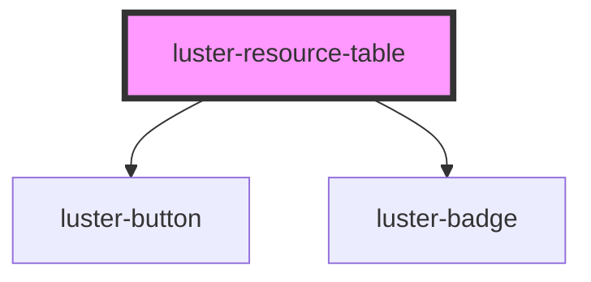

# luster-resource-table

<!-- Auto Generated Below -->

## Properties

| Property | Attribute | Description | Type                      | Default |
| -------- | --------- | ----------- | ------------------------- | ------- |
| `rows`   | `rows`    |             | `ResourceRow[] \| string` | `'[]'`  |

## Dependencies

### Depends on

- [luster-button](../luster-button)
- [luster-badge](../luster-badge)

### Graph

----------------------------------------------

*Built with [StencilJS](https://stenciljs.com/)*
