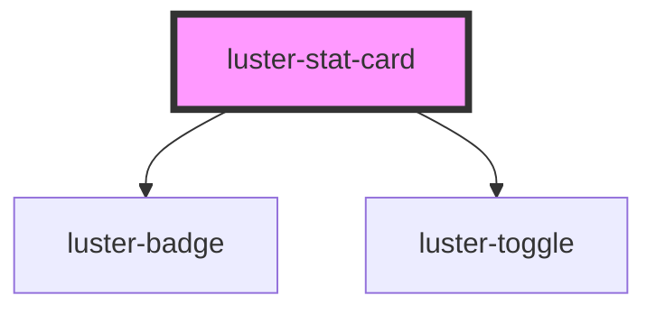

# luster-stat-card

<!-- Auto Generated Below -->

## Properties

| Property      | Attribute     | Description | Type                                 | Default    |
| ------------- | ------------- | ----------- | ------------------------------------ | ---------- |
| `description` | `description` |             | `string`                             | `''`       |
| `hasToggle`   | `has-toggle`  |             | `boolean`                            | `false`    |
| `heading`     | `heading`     |             | `string`                             | `''`       |
| `icon`        | `icon`        |             | `string`                             | `''`       |
| `status`      | `status`      |             | `"active" \| "beta" \| "deprecated"` | `'active'` |
| `toggleOn`    | `toggle-on`   |             | `boolean`                            | `false`    |
| `users`       | `users`       |             | `string`                             | `''`       |
| `version`     | `version`     |             | `string`                             | `''`       |

## Dependencies

### Depends on

- [luster-badge](../luster-badge)
- [luster-toggle](../luster-toggle)

### Graph

----------------------------------------------

*Built with [StencilJS](https://stenciljs.com/)*
